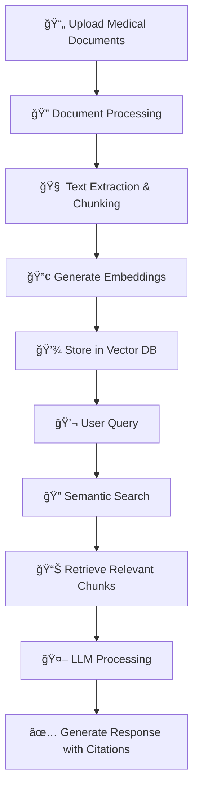

# 🩺 MedicoRAG System

<div align="center">


[](https://www.python.org/)
[](https://streamlit.io/)
[](https://www.trychroma.com/)

**MedicoRAG** is an AI-powered **Retrieval-Augmented Generation (RAG)** system designed to assist healthcare professionals by processing **medical journals, clinical guidelines, and patient data** (anonymized) to deliver **accurate, evidence-based answers** quickly.

⚠️ **Disclaimer:** For healthcare professionals only. Always verify AI-generated information with authoritative sources.

[🚀 Features](#-features) • [📦 Installation](#-installation) • [📖 How It Works](#-how-it-works) • [🤝 Contributing](#-contributing)

</div>

---

## 📋 Table of Contents

- [🚀 Features](#-features)
- [🛠 Tech Stack](#-tech-stack)
- [📂 Project Structure](#-project-structure)
- [📦 Installation](#-installation)
- [📖 How It Works](#-how-it-works)
- [📌 Example Use Cases](#-example-use-cases)
- [🎯 Demo Screenshots](#-demo-screenshots)
- [🔧 Configuration](#-configuration)
- [🤝 Contributing](#-contributing)

---

## 🚀 Features

<table>
<tr>
<td width="50%">

### 📚 **Document Processing**
- Upload and analyze PDFs, research papers
- OCR support for scanned documents
- Clinical guidelines integration
- Multi-format document support

</td>
<td width="50%">

### 💬 **Interactive Chat**
- Natural language medical queries
- Contextually relevant answers
- Citation tracking and sources
- Real-time response generation

</td>
</tr>
<tr>
<td width="50%">

### 🧠 **RAG-Powered AI**
- Vector search capabilities
- Large language model integration
- Semantic document retrieval
- Evidence-based responses

</td>
<td width="50%">

### 📊 **Data Support**
- Anonymized patient data handling
- Structured and unstructured data
- Multi-source search capabilities
- Secure data processing

</td>
</tr>
</table>

---

## 🛠 Tech Stack

| Category | Technology | Purpose |
|----------|------------|---------|
| **Frontend** |  | Interactive web interface |
| **Backend** |  | Core application logic |
| **AI/ML** |  | Language model + retrieval |
| **Database** |  | Vector embeddings storage |
| **Embeddings** |  | Text vectorization |
| **OCR** |  | Document text extraction |

---

## 📦 Installation

### Prerequisites
- Python 3.8 or higher
- Git
- Virtual environment (recommended)

### Quick Start

1. **Clone the repository**
   ```bash
   git clone https://github.com/Pseudo-Sid26/MedicoRAG-system.git
   cd MedicoRAG-system
   ```

2. **Create and activate virtual environment**
   ```bash
   # Windows
   python -m venv venv
   venv\Scripts\activate
   
   # macOS/Linux
   python3 -m venv venv
   source venv/bin/activate
   ```

3. **Install dependencies**
   ```bash
   pip install -r requirements.txt
   ```

4. **Set up environment variables**
   ```bash
   cp .env.example .env
   # Edit .env with your API keys and configurations
   ```

5. **Run the application**
   ```bash
   streamlit run app.py
   ```

6. **Open in browser**
   ```
   Navigate to: http://localhost:8501
   ```

---

## 📖 How It Works



### Step-by-Step Process

1. **📤 Document Upload**: Healthcare professionals upload medical documents (PDFs, research papers, clinical guidelines)

2. **🔧 Processing Pipeline**: Documents are processed using OCR (if needed), text extraction, and chunking

3. **🔢 Embedding Generation**: Text chunks are converted to vector embeddings using state-of-the-art models

4. **💾 Vector Storage**: Embeddings are stored in ChromaDB for efficient similarity search

5. **💬 Query Processing**: Users ask medical questions in natural language

6. **🔍 Retrieval**: System performs semantic search to find most relevant document chunks

7. **🤖 Answer Generation**: LLM generates evidence-based responses with proper citations

---

## 📌 Example Use Cases

<div align="center">

| Use Case | Description | Example Query |
|----------|-------------|---------------|
| 🩻 **Imaging Protocols** | Review radiology guidelines | "What is the standard protocol for chest CT scanning?" |
| 💊 **Drug Dosage** | Check medication guidelines | "What is the recommended dosage of metformin for type 2 diabetes?" |
| 📑 **Clinical Trials** | Summarize research findings | "Summarize recent trials on immunotherapy for lung cancer" |
| 📋 **Case Analysis** | Interpret patient data | "Analyze symptoms: fever, cough, shortness of breath" |

</div>

---

## 🔧 Configuration

### Environment Variables

Create a `.env` file in the root directory:

```env
# API Keys
GROQ_API_KEY=your_groq_api_key_here
HUGGINGFACE_API_KEY=your_huggingface_key_here

# Database Configuration
CHROMA_PERSIST_DIRECTORY=./data/embeddings
CHROMA_COLLECTION_NAME=medical_documents

# Application Settings
MAX_UPLOAD_SIZE=100MB
CHUNK_SIZE=1000
CHUNK_OVERLAP=200

# Model Configuration
EMBEDDING_MODEL=sentence-transformers/all-MiniLM-L6-v2
LLM_MODEL=gpt-3.5-turbo
TEMPERATURE=0.1
```

### Customization Options

- **Document Types**: Configure supported file formats
- **Chunk Size**: Adjust text chunking parameters
- **Model Selection**: Choose different LLM and embedding models
- **UI Themes**: Customize Streamlit interface

---

## 🤝 Contributing

We welcome contributions from the community! Here's how you can help:

### How to Contribute

1. **🍴 Fork the repository**
2. **🌿 Create a feature branch**
   ```bash
   git checkout -b feature/amazing-feature
   ```
3. **💻 Make your changes**
4. **✅ Commit your changes**
   ```bash
   git commit -m 'Add some amazing feature'
   ```
5. **📤 Push to the branch**
   ```bash
   git push origin feature/amazing-feature
   ```
6. **🔄 Open a Pull Request**

### Contribution Guidelines

- Follow PEP 8 style guidelines
- Add unit tests for new features
- Update documentation as needed
- Ensure HIPAA compliance for medical data handling

### Areas for Contribution

- 🐛 Bug fixes and improvements
- 📚 Documentation enhancements
- 🧪 Additional test coverage
- 🎨 UI/UX improvements
- 🔧 New feature development

---

<div align="center">

### 📞 Contact & Support

**Developed by:** [Siddhesh Chavan](https://github.com/Pseudo-Sid26)

[](https://github.com/Pseudo-Sid26)
[](https://github.com/Pseudo-Sid26/MedicoRAG-system)

**⭐ Star this repository if you find it helpful!**

---

*Made with ❤️ for the healthcare community*

</div>
